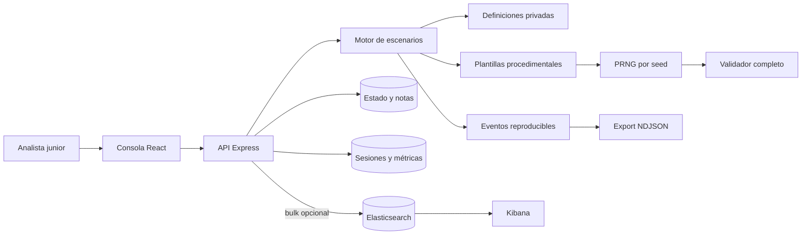

# SOC Analyst Training Lab

Laboratorio local, seguro y reproducible para practicar triage, investigación y respuesta a incidentes con telemetría sintética. Incluye una consola SOC web, 30 escenarios completos, evaluación automática, datasets NDJSON y un entorno opcional Elasticsearch/Kibana.

> Todo el contenido es sintético. El proyecto no ejecuta malware, no genera tráfico ofensivo y no se conecta a objetivos externos.

## Qué incluye

- 30 escenarios progresivos: fundamentos, correlación multifuente, cadenas multi-stage y triage ambiguo.
- 2.951 eventos reproducibles con ruido benigno y 12 fuentes: Windows, Sysmon, Linux, DNS, HTTP, autenticación, red, Suricata, firewall, endpoint, correo y cloud.
- 9 plantillas procedimentales con seeds compartibles, dificultad `easy`/`medium`/`hard` y modo aleatorio sin spoilers.
- Challenge Mode persistente: Quick (1), Training (3), SOC Shift (5) y sesiones Custom reproducibles por seed.
- Mapa temporal interactivo: distribución de eventos, filtros por fuente e inspección de intervalos sin revelar la solución.
- Interfaz oscura adaptable a escritorio y móvil, con navegación unificada y vistas de entrenamiento, historial y estadísticas centradas.
- Flujo de analista: cola, severidad, estados, evidencias, notas, preguntas y resolución explicada.
- Referencias KQL, SPL y Sigma por escenario.
- API validada, persistencia local y exportación NDJSON.
- Elasticsearch/Kibana opcionales mediante Docker Compose.
- Tests unitarios, de API, componentes, reproducibilidad, IOC y capacidad de respuesta.

## Inicio rápido

Requisitos: Node.js 22+ y npm 10+.

```bash
npm install
npm run dev
```

Abre [http://localhost:5173](http://localhost:5173). La API escucha en `http://localhost:3001`.

Para construir y ejecutar como producción:

```bash
npm run build
npm start
```

Genera una variante reproducible o lista las plantillas disponibles:

```bash
npm run generate:scenario -- --template password-spray --seed 92817
npm run generate:scenario -- --random --seed 82913 --difficulty hard
npm run generate:scenario -- --list
```

La identidad `password-spray:92817:easy` regenera exactamente la misma definición, eventos y hash. Los parámetros API opcionales también quedan codificados, por ejemplo `password-spray:77:medium:noise=88:scale=1.375`. Sin `--output` el CLI escribe el artefacto explícito en `output/procedural/`; la aplicación y la API regeneran por identidad y no dependen de ese fichero.

Abre [http://localhost:3001](http://localhost:3001).

## Docker

Modo ligero, sólo aplicación:

```bash
docker compose up --build
```

Modo SIEM completo (recomendados 4 GB de RAM libres):

```bash
docker compose --profile siem up --build
```

Cuando Elasticsearch esté disponible, indexa los 2.951 eventos:

```bash
curl -X POST http://localhost:3001/api/elastic/sync
```

En PowerShell:

```powershell
Invoke-RestMethod -Method Post http://localhost:3001/api/elastic/sync
```

Kibana queda en [http://localhost:5601](http://localhost:5601). Importa `infra/kibana/soc-training.ndjson` desde **Stack Management → Saved Objects → Import**. El fichero crea el data view, una búsqueda de señales y el dashboard Watchfloor.

## Comandos

| Comando | Uso |
|---|---|
| `npm run dev` | API y web con recarga |
| `npm run generate` | Genera un NDJSON por escenario en `datasets/` |
| `npm run generate:scenario -- --template <id> --seed <n>` | Genera una variante procedural validada |
| `npm run generate:coverage` | Regenera la matriz de cobertura desde el catálogo |
| `npm run validate:scenarios` | Valida schema, determinismo, evidencias, IOC, MITRE, consultas, Sigma y spoilers |
| `npm run validate:procedural` | Dogfooding de 324 variantes, hashes, scoring, diversidad y rendimiento |
| `npm run validate:challenge` | Dogfooding de sesiones, recuperación, pistas, respuestas y rendimiento |
| `npm test` | Ejecuta la suite de pruebas |
| `npm run typecheck` | TypeScript estricto en cliente y servidor |
| `npm run lint` | ESLint |
| `npm run build` | Build cliente + servidor |
| `npm run check` | Todas las verificaciones |

## Arquitectura



El navegador recibe metadatos, preguntas y evidencias, pero no claves de respuesta. El servidor desbloquea solución, cronología, IOC y consultas después de la entrega. En un proyecto local el código fuente siempre puede inspeccionarse; esta separación evita que la solución aparezca en el bundle o en peticiones previas a la evaluación, no pretende ser un control antifraude.

## Estructura

```text
src/client/       consola React y componentes
src/domain/       contratos compartidos
src/scenarios/    definiciones y generador determinista
src/server/       API, persistencia e integración Elastic
scripts/          generación offline de datasets
tests/            unit, API y componentes
infra/kibana/     objetos guardados para importar
docs/             guías de estudiante, instructor y extensión
```

## API principal

- `GET /api/health`
- `GET /api/scenarios`
- `GET /api/procedural/templates`
- `POST /api/procedural/generate`
- `GET /api/scenarios/:id`
- `GET /api/scenarios/:id/events?q=...`
- `PATCH /api/scenarios/:id`
- `POST /api/scenarios/:id/submit`
- `GET /api/scenarios/:id/export`
- `POST /api/elastic/sync`
- `POST /api/sessions`
- `GET /api/sessions/:id`
- `GET /api/sessions/:id/incidents/:incidentId`
- `PATCH /api/sessions/:id/incidents/:incidentId`
- `POST /api/sessions/:id/incidents/:incidentId/submit`
- `GET /api/sessions/history`
- `GET /api/sessions/stats`

Los cuerpos de escritura se validan con Zod y tienen límites de tamaño. La API desactiva la cabecera de tecnología y no expone respuestas antes de evaluar.

## Documentación

- [Arquitectura](docs/ARCHITECTURE.md)
- [Guía del estudiante](docs/STUDENT_GUIDE.md)
- [Guía del instructor](docs/INSTRUCTOR_GUIDE.md)
- [Crear escenarios](docs/CREATING_SCENARIOS.md)
- [Generación procedural](docs/PROCEDURAL_SCENARIOS.md)
- [Challenge Mode](docs/CHALLENGE_MODE.md)
- [Motor de validación](docs/VALIDATION.md)
- [Catálogo de escenarios](docs/SCENARIOS.md)
- [Matriz de cobertura](docs/COVERAGE_MATRIX.md)
- [Troubleshooting](docs/TROUBLESHOOTING.md)

## Seguridad y alcance

Las IP públicas usadas pertenecen a rangos de documentación o se tratan como IOC sintéticos. Los dominios terminan en `.example`. Los puertos publicados por Compose se enlazan sólo a `127.0.0.1`. No uses este laboratorio como sistema de producción ni expongas Elasticsearch sin autenticación; `xpack.security.enabled=false` existe únicamente para la red Docker local de entrenamiento.

## Licencia

MIT. Consulta [LICENSE](LICENSE).
