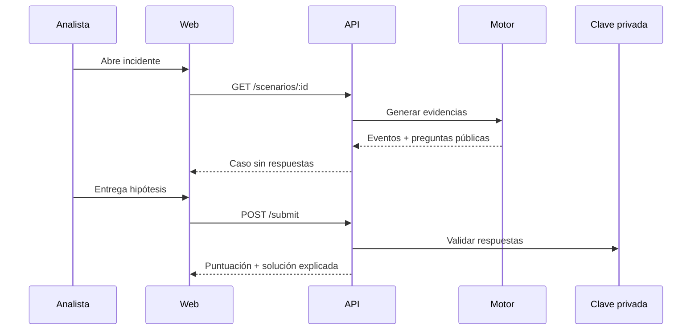

# Arquitectura

## Decisiones

La aplicación usa un monolito modular TypeScript para reducir fricción local: Vite sirve React en desarrollo y Express sirve el build en producción. El dominio y el motor son módulos independientes, por lo que pueden extraerse si el proyecto crece.

El generador mezcla una cantidad configurable de eventos benignos con la timeline relevante de cada escenario. Una PRNG con semilla fija mantiene IDs, orden y timestamps reproducibles. Los diez casos originales conservan su generación histórica; los nuevos seleccionan fuentes y volumen de ruido según dificultad. Cada evento conserva campos normalizados (`host`, `user`, `sourceIp`, `destinationIp`, `eventCode`, `action`, `outcome`) y detalles específicos de la fuente.

La capa procedural no modifica el catálogo canónico. Una plantilla validada selecciona un escenario estable como blueprint y declara fases, dependencias, actores, infraestructura, variables, perfil de ruido, verdad y contrato de investigación. El motor aplica una transformación única sobre toda la definición privada —incluidas respuestas, evidencias, IOC, KQL/SPL/Sigma— y sólo publica la variante después de ejecutar el mismo `scenarioSchema` y todas las reglas semánticas.

## Módulos

- `domain`: tipos estables del contrato.
- `scenarios`: catálogo, claves, consultas y generación.
- `procedural`: schemas de plantilla/input, PRNG, pools sintéticos, catálogo procedural y motor de variantes.
- `server`: transporte HTTP, validación, estado e ingestión.
- `client`: presentación y estado de interfaz.

## Persistencia

Estados, notas y progreso se guardan en `data/state.json`, dentro de un documento con `schemaVersion`. El lector acepta el formato legado sin envoltorio, valida tipos y límites al arrancar y rechaza de forma explícita JSON truncado o incompatible. Las escrituras se realizan mediante fichero temporal y renombrado para no dejar estados parciales; si fallan, tampoco se confirma el cambio en memoria.

La aplicación está diseñada para una sola instancia local. Las actualizaciones son síncronas dentro del proceso y, ante dos cambios válidos simultáneos sobre las mismas notas, prevalece el último. No existe coordinación entre varios procesos que compartan el mismo fichero. Los estados son etiquetas de flujo para el ejercicio, no una máquina de estados normativa: el analista puede reclasificar o reabrir un caso sin una secuencia obligatoria.

Los datasets no se almacenan porque son deterministas. Docker utiliza un volumen para el estado y otro para Elasticsearch.

Las variantes tampoco requieren persistencia: `proc-<template>-s<seed>-<difficulty>` y `proc-random-s<seed>-<difficulty>` contienen lo necesario para regenerarlas. La API conserva como optimización una LRU de 32 variantes por proceso. Se invalida al reiniciar o desplegar código nuevo; no interviene en la identidad ni en la corrección.

Challenge Mode sí persiste el plan y cada intento en `data/sessions.json`. El plan privado contiene únicamente la referencia canónica o plantilla/seed procedural necesaria para regenerar el dataset; no duplica eventos. El contrato público reemplaza esas identidades por `incident-XX`, bloquea categoría/verdad/IOC/MITRE hasta la entrega y conserva sólo las respuestas parciales del propio analista. Cada cambio incluye una revisión optimista, por lo que una actualización obsoleta recibe conflicto en lugar de sobrescribir progreso reciente. Consulta [Challenge Mode](CHALLENGE_MODE.md).

## Elasticsearch

`POST /api/elastic/sync` crea `soc-training-events`, aplica mappings de fecha, keyword e IP y realiza un bulk idempotente usando el ID del evento. Sólo se permite una sincronización simultánea por proceso y el cliente se cierra al terminar. Kibana trabaja sobre ese índice.

## Validación del catálogo

El motor usa capas pequeñas en vez de una función monolítica:

- `schema.ts`: contrato Zod estricto para definiciones y eventos;
- `finalize.ts`: compatibilidad de las definiciones heredadas, metadata, fuentes y referencias de evidencia;
- `validation.ts`: reglas semánticas, temporales, de contenido y calidad;
- `cli.ts`: salida humana/JSON, filtros y códigos de proceso;
- `coverage.ts`: matriz global derivada automáticamente.

`npm run validate:scenarios` ejecuta la puerta sobre los 30 casos sin levantar la aplicación. La API mantiene una proyección pública separada y los tests inspeccionan recursivamente sus respuestas para evitar que claves, timelines privadas, IOC o consultas lleguen al cliente antes de resolver. Consulta [Motor de validación](VALIDATION.md) para reglas, severidades y extensión.
