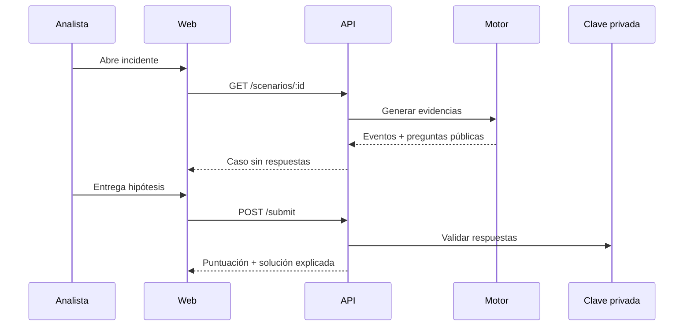

# Arquitectura

## Decisiones

La aplicación usa un monolito modular TypeScript para reducir fricción local: Vite sirve React en desarrollo y Express sirve el build en producción. El dominio y el motor son módulos independientes, por lo que pueden extraerse si el proyecto crece.

El generador mezcla 42 eventos benignos con cuatro o más eventos maliciosos por escenario. Una PRNG con semilla fija mantiene IDs, orden y timestamps reproducibles. Cada evento conserva campos normalizados (`host`, `user`, `sourceIp`, `eventCode`, `action`, `outcome`) y detalles específicos de la fuente.

## Módulos

- `domain`: tipos estables del contrato.
- `scenarios`: catálogo, claves, consultas y generación.
- `server`: transporte HTTP, validación, estado e ingestión.
- `client`: presentación y estado de interfaz.

## Persistencia

Estados, notas y progreso se guardan en `data/state.json`. Los datasets no se almacenan porque son deterministas. Docker utiliza un volumen para el estado y otro para Elasticsearch.

## Elasticsearch

`POST /api/elastic/sync` crea `soc-training-events`, aplica mappings de fecha, keyword e IP y realiza un bulk idempotente usando el ID del evento. Kibana trabaja sobre ese índice.
